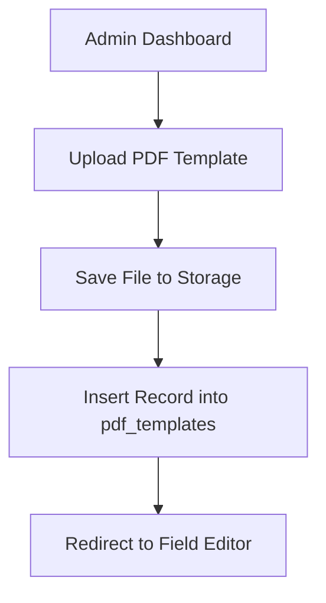
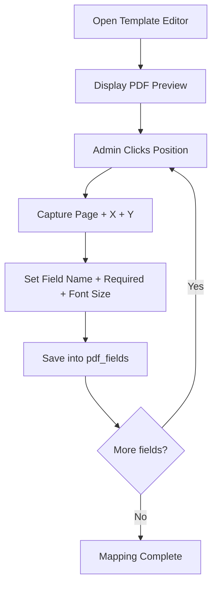
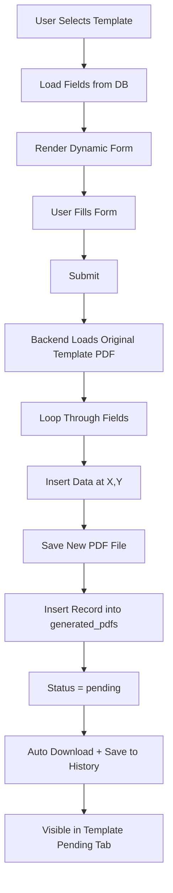
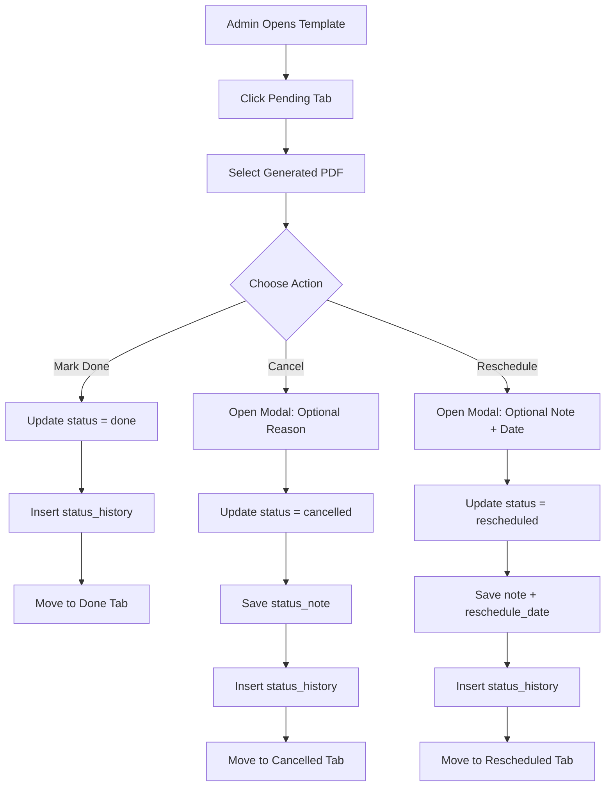

# System Flow Diagrams (Part 1)

This document defines the 5 major system flows for the PDF Word Insert & Workflow Management System.

## 1. Authentication Flow

```mermaid
flowchart TD
    A[User Visits Website] --> B[Login Page]
    B --> C[Submit Email + Password]
    C --> D[Backend Validate Credentials]
    D --> E[Role Assigned in JWT]
    E --> F{Role}
    F -->|super_admin| G[/admin]
    F -->|admin| H[/admin]
    F -->|user| I[/user]
```

Security requirements:
- Passwords are hashed (`bcrypt`).
- JWT is issued on successful login.
- Role-based middleware protects routes.

## 2. Template Creation Flow (Admin)



Result:
- Template is ready for field mapping.

## 3. Field Mapping Flow



## 4. PDF Generation Flow (User)



## 5. Workflow Status Management Flow



Isolation rule per template:
- `WHERE template_id = ? AND status = ?`
- No cross-template record mixing.
